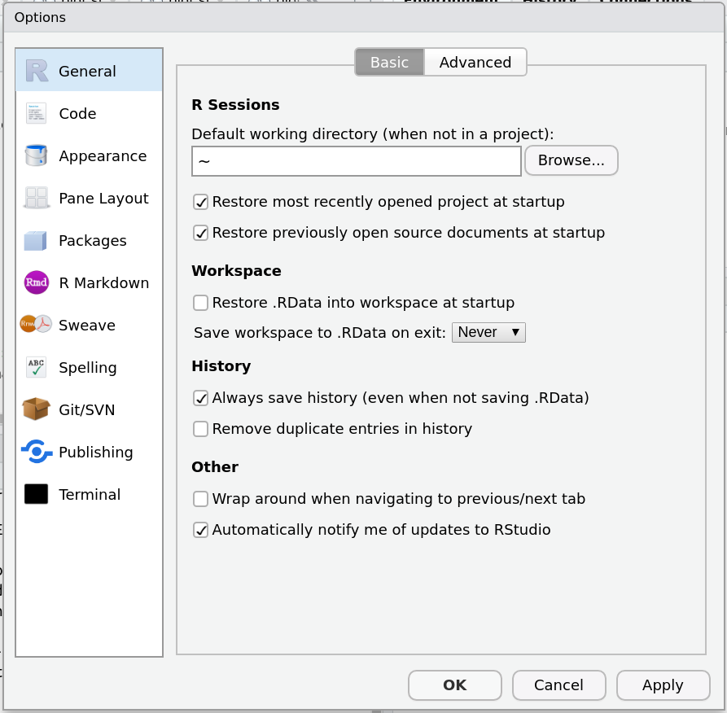

### Copyright

All the material presented here, to the extent it is original, is available under [CC-BY-SA](https://creativecommons.org/licenses/by-sa/2.0/).

```{r setup, include=FALSE}
knitr::opts_chunk$set(echo = TRUE)
```

## What is R? what is RStudio?

R is a program, that runs a REPL (read-evaluate-print-loop). If you start it interactively, you see a prompt; if you type a command on the prompt and press "enter", the command is evaluated and the result is printed:
```{r}
1+2
a <- 2
```
The second command is an assignment: 2 is assigned to `a`. The result is not printed. We could force printing by
```{r}
(a <- 2)
```
An alternative to assignment using the "left-arrow", `<-`, is using `=`
```{r}
(a = 2)
```


### RStudio

RStudio is an application (program) that provides an IDE (integrated
development environment) for R, that makes it easy to manage R data,
R scripts, R markdown files, and develop R packages. The basic
RStudio is free of charge, commercial versions provide all kind of
extra's like business integration, user management, collaboration,
cloud deployment, and so on.

RStudio uses R.

It makes sense to try to understand when a particular problem is caused
by RStudio, or by R; sometimes this is difficult.

## Objects, functions, interfaces

In his book "Extending R", John Chambers summarizes R with

* everything that is, is an object
* everything that happens is a function call
* Most work in R happens through interfaces to other languages (C, C++, Fortran, ...)

This also applies to infix expressions such as `2 + 3`: these are just alternative
writings of the function evaluation
```{r}
`+`(2, 3)
```
of function `+` and arguments 2 and 3.

We can also make our lives difficult by
```{r}
`+` = `-` # replace + by -
3 + 2
```
but we will not do this, and remove [the bad plus](https://www.thebadplus.com/album) by:
```{r}
rm(`+`)
3 + 2 # check:
```

## Objects

See `?typeof` for the complete list of object _types_. Some of them
are concerned with language: you can manipulate language objects, and
e.g.  manipulate expressions before they are evaluated (executed). But
that is advanced.

The most interesting objects are data objects, and functions.

### class, mode, length

Objects always have a class, 
```{r}
(a = 3:1)
class(a)
```

and data objects have a length and a mode:
```{r}
length(a)
mode(a)
```

R does not have scalars: single numbers are vectors of length 1:
```{r}
(a = 1)
length(a)
```

We can index (select) vector elements using `[`:
```{r}
(a = c(1,2,3,4,5,10,11,12))
a[3]
a[3:5]
```

Each data type has a special value, `NA`, denoting a "not available" (missing) value.
```{r}
c(1,3,NA,5)
c(TRUE,TRUE,NA,FALSE)
c("alice", "bob", NA, "dylan")
```

R has both `integer` and `double` representations of `numeric`,
but you rarely need to know this.

### attributes

Data objects can have attributes, which contain metadata of an object.
```{r}
a = 3
attr(a, "foo") = "bar"
a
```
Attributes with predefined semantics are e.g. `names`, `class`, and `dim`:
```{r}
a = 1:4
attr(a, "names") = c("first", "second", "third", "fourth")
a
attr(a, "dim") = c(2, 2) # now a is interpreted as a 2 x 2 matrix:
a
```

### matrix, array

Matices and arrays are created from vectors, by setting the number
of rows/columns, or the dimensions. They have a `dim` attribute and a
`dim` method to get or set `dim`:

```{r}
(m = matrix(1:10, nrow = 2, ncol = 5))
m[1:2, 2:3]
dim(m)
dim(m) = c(5, 2) # but not transpose!
attributes(m)
m
(a = array(1:24, c(2,3,4)))
a[,2,] # second slice for dimension 2, retain all others:
```

### Generic vector: list

Mixing types in single vectors doesn't go well: elements are coerced to the type that can ultimately hold everything:
```{r}
c(1, FALSE)
c(1, FALSE, "foo") 
```

For this, lists of arbitrary objects can be used: 
```{r}
(a = list(1, c(TRUE, FALSE, TRUE, NA), c("foo", "bar")))
class(a)
```
Indexing lists is special: a single `[` returns a list:
```{r}
a[1]
a[2:1]
```
and a double `[[` retrieves the _contents_ of a _single_ list element:
```{r error=TRUE}
a[[1]]
a[[2]]
```

### data.frame

`data.frame` objects are VERY common in R, and are used to represent
tabular data, with table columns potentially of different type.
```{r}
(d = data.frame(a = 1:3, b = c("alice", "bob", "charly"), t = as.Date("2019-08-31") + c(1,3,5)))
d[1:2, ] # first two rows
d[, 2:3] # last two columns
d[2, 3] # single element, as value
d[2, 3, drop = FALSE] # single element, but as data.frame
```

### Functions as objects

## Functions

Functions are also objects; if you type their name, they are printed:
```{r}
sd
```
For many functions, the result is a bit obscure, e.g. `mean`:
```{r}
mean
```
the `UseMethod` indicates that `mean` is a _generic_, which has methods that depend
on the class of the first argument; we list methods by
```{r}
methods(mean)
```
and `mean.default` is the default method, called when `mean` is called with anything
else (so, for example, a `numeric` vector). We can then list `mean.default`
```{r}
mean.default
```
and see that that calls, after optional trimming and handling `NA` values, an
`.Internal` version of mean, which, in the end, for real numbers calls [this](https://github.com/wch/r-source/blob/trunk/src/main/summary.c#L476-L494) C function (which does _more_ than a simple `sum(x)/length(x)`!)

This trick does not always work:
```{r error=TRUE}
methods(quantile)
quantile.default
```
We see that the method is marked with a `*`: use `?quantile` to discover
that `quantile` comes from package stats, then obtain the function with
```{r eval=FALSE}
stats:::quantile.default # (output suppressed)
```
What happens here is that package `stats` exports the default method for
`quantile`, but not the _function_ `quantile.default`; `:::` allows
one to peek into non-exported functions. For those who are curious
what is going on.

### self-made functions

We can also _create_ functions:
```{r}
mean_plus_one = function(x) {
  mean(x) + 1
}
```
R does not need a `return` statement: the result of the last expression in a function is the value returned:
```{r}
mean_plus_one(c(1,2,3))
```
If we want other arguments (like `trim` and `na.rm`) to also work here, we can pass them on
using the `...` trick:

```{r error=TRUE}
mean_plus_one = function(x, ...) {
  mean(x, ...) + 1
}
mean_plus_one(c(1,2,NA,3))
mean_plus_one(c(1,2,NA,3), na.rm = TRUE)
```

We can also create functions that have no name:
```{r}
function(x){mean(x)+1}
```
and call them
```{r}
(function(x){mean(x)+1})(c(5,6,7))
```

We can also pass functions as arguments:
```{r}
furniture = data.frame(
  what = rep(c("table", "chair"), each = 2),
  weight = c(25, 27, 8, 11))
aggregate(x = furniture["weight"], by = furniture["what"], FUN = max)
```
Here, `max` is passed as an argument to `aggregate`, which is applied
to `x` values of each group defined by `by`.

## R in practice

### Environments, .GlobalEnv

Where does R find things? In environments, similar to (in-memory) directories in your search path:
```{r}
search()
library(sf)
search()
```
As you see, adding a library puts it on the search path, behind `.GlobalEnv`.
`.GlobalEnv` is the global environment, where things like
```{r}
a = 5:10
ls()
a
```
are put, and retrieved from.

You can use R (RStudio) in interactive mode (called _console_
in RStudio), which helps trying things out and learning, but for
serious work you will never do it. Although R saves your .GlobalEnv
(optionally) before it shuts down, and reads it at startup next
time, and also saves/restores your command history, working this
way has large disadvantages:

* the command history contains _all_ commands, also those that failed
* the objects in `.GlobalEnv` do not have a history, i.e. you cannot unambiguously find out how they were created
* working this way constantly increases your `.GlobalEnv`, and is like allways doing all your work in your home directory.

Instead, a better way of working is:

* always start R without reading data on startup
* type commands in R scripts, or better: R markdown documents 
* run the commands from there
* when quitting R (RStudio): don't save .GlobalEnv to a file

This also means that the script needs to have the following sections:

* possibly load packages needed
* load data (e.g. read it from a file, or a package)
* do analysis
* write output (figures, tables, or data file(s))

Together with your data, this script provides a completely reproducible process!

In RStudio, you can make not reading/saving the default by Tools - Global Options - General - Workspace: un-check the button "restore data at worspace startup", and set "save workspace to .RData on exit" to "never":

```{r echo=FALSE}

```

## Watch out for...

### memory usage

R will not warn you _before_ you push it to its limits, but only error when you do:

```{r error=TRUE}
x = 1:1e12
object.size(x) # clearly doesn't exist as such!
x + 1
```

By default, R does everything in main memory.  If you do a
computation that gradually exhausts memory, your computer will
become very slow when it uses virtual memory, and _may_ react
to follow-up memory shortage by shutting down processes randomly
(not starting with R, necessarily).

### compute capacity/speed

R will not tell you in advance how long a computation will take,
unless someone has implemented a progress bar or counter.  Waiting
very long is often not very productive; try working with smaller
datasets, then somewhat larger, and make some timings, to get a
feel for how long something will take:

```{r}
system.time(a <- sin(runif(1e6))) # here <- is needed, = has a different meaning in a function call
system.time(a <- sin(runif(1e7)))
```
